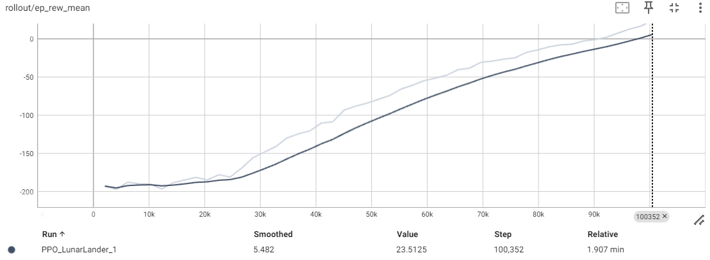
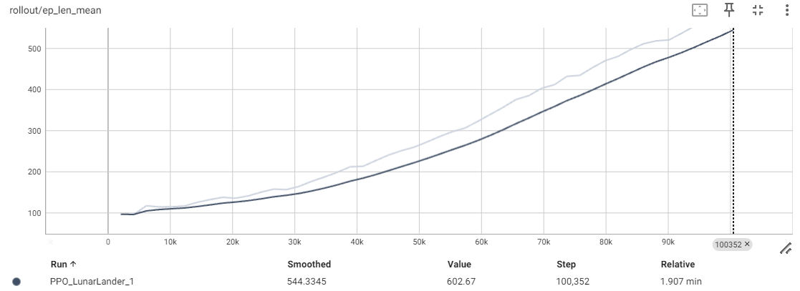
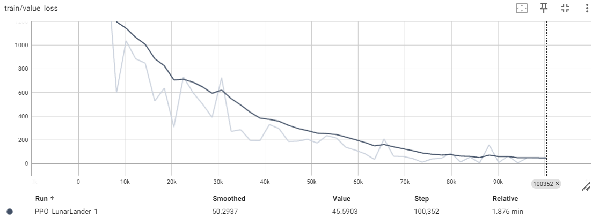
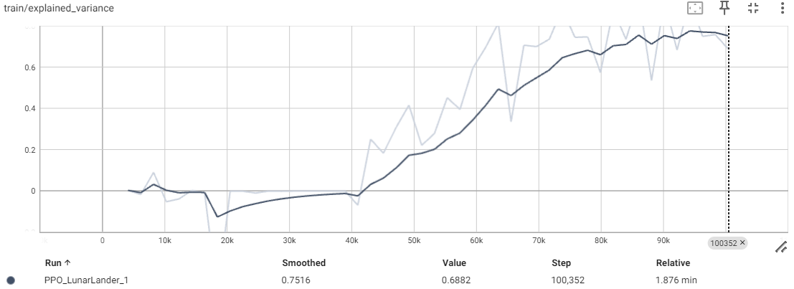
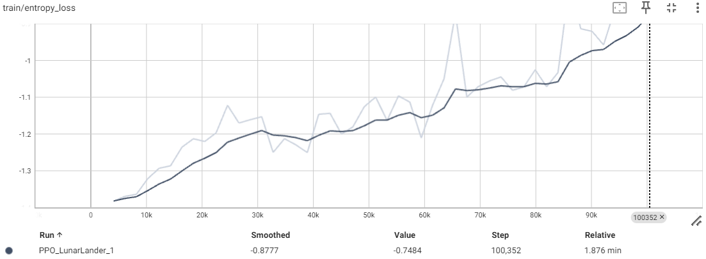

# 🚀 PPO Reinforcement Learning for LunarLander-v3


> An intelligent agent trained to land a spacecraft safely on the moon using **Proximal Policy Optimization (PPO)**.

   -yellow)

## 📖 项目简介

此项目旨在利用深度强化学习（Deep Reinforcement Learning）解决经典的 **LunarLander-v3** 控制问题。通过使用 **Stable-Baselines3** 库中的 **PPO** 算法，智能体（Agent）学会了在离散动作空间下控制主引擎和侧引擎，实现克服月球重力并平稳着陆。

项目完全在 **Linux (Ubuntu on WSL)** 环境下开发，并使用 **TensorBoard** 记录训练过程中的关键指标。

---

## 🎥 效果展示







---

## 🛠️ 环境与算法

### 环境: LunarLander-v3
*   **目标**: 控制着陆器从屏幕顶部移动到坐标 (0,0) 的着陆台（两面黄旗之间）。
*   **状态空间 (8维)**: 坐标 (x, y)、速度 (vx, vy)、角度、角速度、腿部触地传感器状态。
*   **动作空间 (离散)**:
    *   `0`: 不操作
    *   `1`: 喷射左引擎
    *   `2`: 喷射主引擎
    *   `3`: 喷射右引擎
*   **奖励机制**: 
    *   安全着陆: +100
    *   坠毁: -100
    *   引擎喷射: 微小的负奖励 (模拟燃料消耗)

### 算法: PPO (Proximal Policy Optimization)
相比于其他算法，我选择了 **PPO**，原因如下：
1.  **稳定性**: PPO 的 Clip 机制防止了策略更新步幅过大，训练收敛更稳定。
2.  **适应性**: PPO 的 Actor-Critic 架构天然适合此类物理控制任务（类似控制器+观测器）。
3.  **行业标准**: PPO 是目前 OpenAI 等机构的主流算法（Used in ChatGPT training）。

---

## ⚡ 安装指南

本项目在 **WSL (Ubuntu 22.04)** 下开发，依赖 `swig` 和 `box2d`。

### 1. 系统依赖
```bash
sudo apt-get update
sudo apt-get install -y swig build-essential python3-dev
``` 
### 2.  Python 依赖 
建议使用 Conda 创建虚拟环境：
```bash
conda create -n rl_env python=3.10
conda activate rl_env
pip install "gymnasium[box2d]" stable-baselines3 tensorboard shimmy
``` 

## 📊 结果分析

### 关键指标解读


#### 1.平均奖励 (rollout/ep_rew_mean):

*   **趋势:** 曲线从初始的 -200（频繁坠毁）一路上升，最终>0。
*   **意义:** 证明 Agent 成功学会了“反重力悬停”和“定点着陆”策略。


#### 2.回合长度 (rollout/ep_len_mean):

*   **趋势:** 回合长度从 100 增加到 600。
*   **意义:** 初始阶段 Agent 快速坠毁（时间短）；后期 Agent 学会了空中姿态调整和缓慢下降（控制过程变长），这是学会控制的特征。


#### 3.价值损失 (train/value_loss):

*   **趋势:** 迅速下降并收敛。
*   **意义:** Critic 网络对当前状态的价值预判越来越准确，系统的“自我评价体系”已建立。

## 📂 项目结构
```text
.
├── logs/                   # TensorBoard logs
├── models/                 # Saved PPO models (.zip)
├── images/                 # Saved some images
├── train.py                # Main training script
├── README.md               # Project documentation
└── .gitignore
```

Run under Linux (WSL) | Powered by Stable-Baselines3


